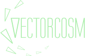

# Vectorcosm

Vectorcosm is an AI aquarium for digital lifeforms. It is a curious viewing experience and a science experiment in digital biology.

Vectorcosm runs as a client-side javascript app in a web browser. It creates a world made entirely of SVGs (Scalable Vector Graphics). Starting Vectorcosm will create a tank with random lifeforms ("boids"), plants, and rocks. Boids will eat food, grow, reproduce, learn, and adapt.

Vectorcosm also includes a suite of automated AI-training simulators you can use to help boids learn basic life skills quickly.

## Demo

The current dev build can be found at https://leiavoia.net/vectorcosm/

## Build

To download and build the app locally, you must have Git and Node/NPM already installed. 

1. Clone the repository:
	```bash
	git clone https://github.com/leiavoia/vectorcosm.git
	```
2. Navigate to the project directory:
	```bash
	cd vectorcosm
	```
3. Install dependencies:
	```bash
	npm install
	```
4. Run the app in your browser:
	```bash
	npm run dev
	```
5. Alternatively, build the app for distribution:
	```bash
	npm run build
	```

## Hotkeys

- **1** - Toggle tank statistics
- **2** - Toggle simulation settings
- **3** - Toggle camera settings
- **4** - Toggle boid library
- **5** - Toggle simulation launcher
- **9** - Save all boids to buffer
- **0** - Load all boids from buffer
- **S** - Save tank to buffer
- **A** - Load tank from buffer
- **B** - Toggle Braingraph on current boid
- **HOME** - Fit tank to current browser window
- **END** - Fast-forward simulation
- **PGUP**, **PGDOWN** - Cycle boid viewer window
- **Arrow Keys** - Move camera
- **+-** - Camera zoom


## License

There is no license.
